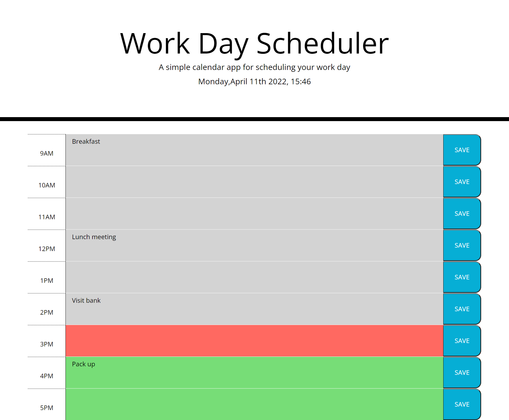

# day-planner
For this project I needed to create a day planner that had dynamic elements to the HTML including a running clock and date as well as Timeblocks that changed based on the time.

When you open this application you will be presented with a Work Day Scheduler that shows the date and time that you opened the page as well as timeblocks that change colours based on whether that timeblock is in the past, present or future. You are able to enter events into these timeblocks you are able to save events that you need to keep track of during the day and these events will remain in the calander even if you refresh the page. Each item will remain in the calander until you decide to delete them which can be done by clearing the relevant text area and pressing the save button. 

Below is a screenshot which displays the applications functionality as well as a link to the deployed application:

Application link: https://gkal14.github.io/day-planner/